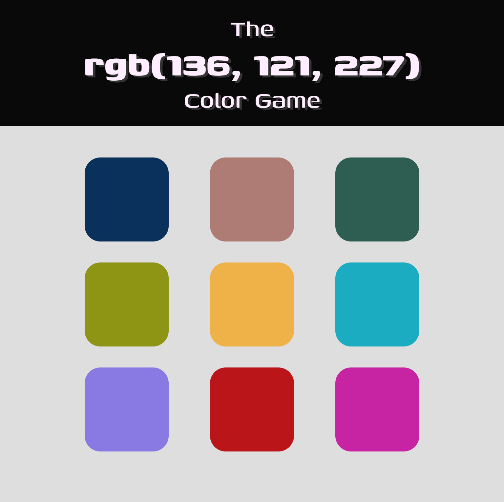

# Color game v2

    

A simple color game where you win by choosing the right RGB color shown in header.

## 🚀 How to run

1. Open project folder and run `yarn` to install all dependencies;
2. Run `yarn start`.